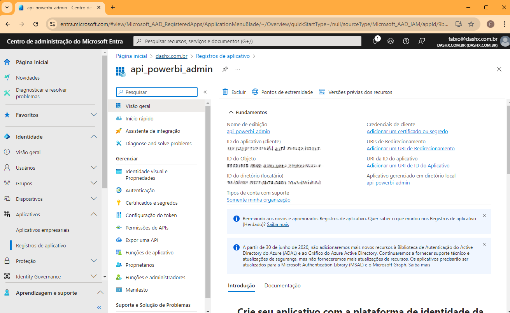
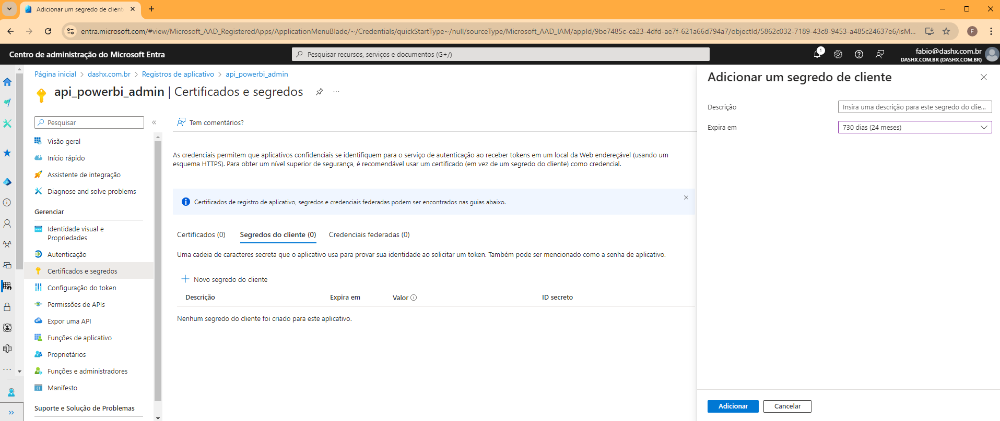
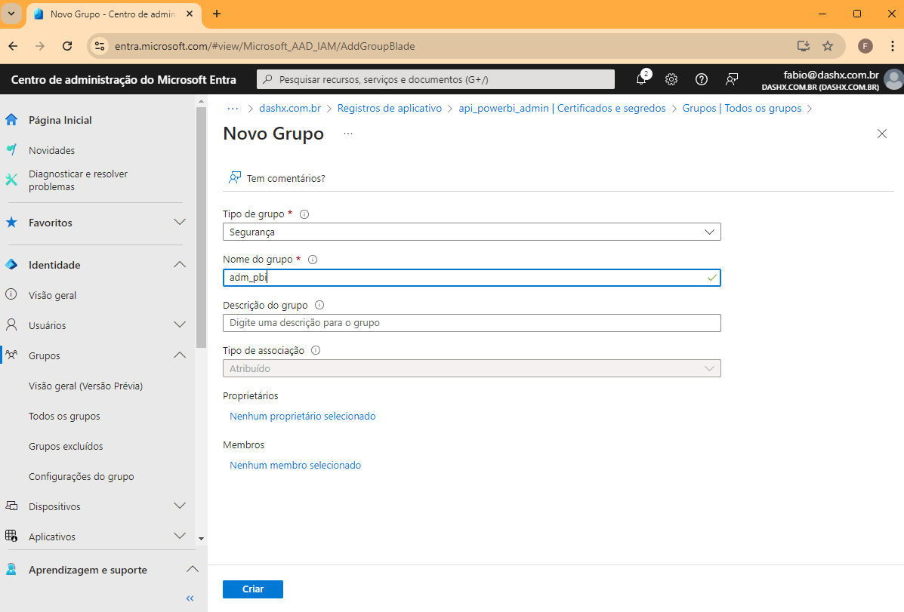
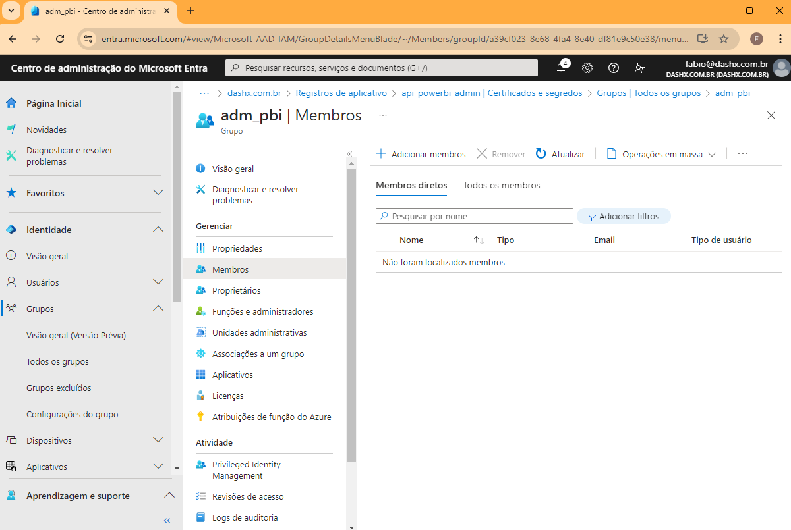
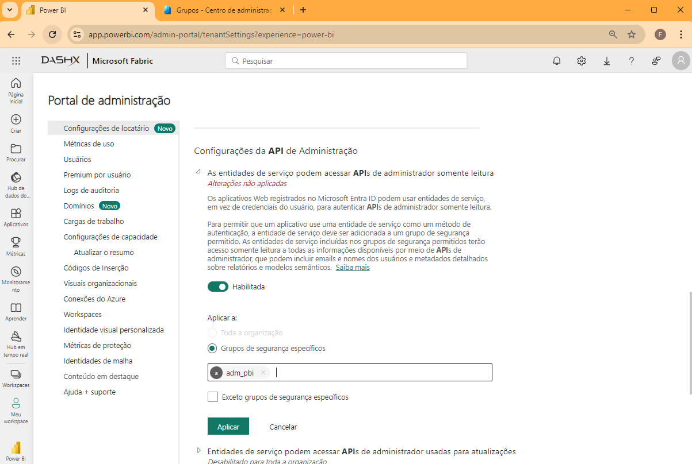
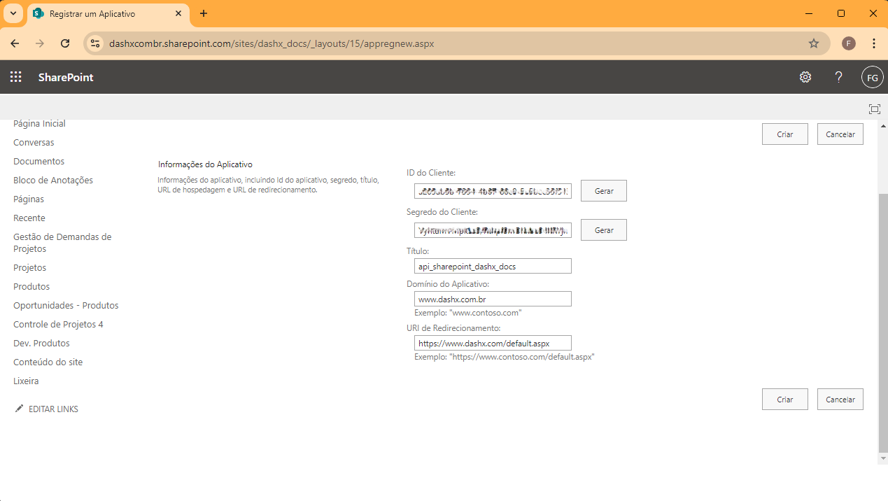
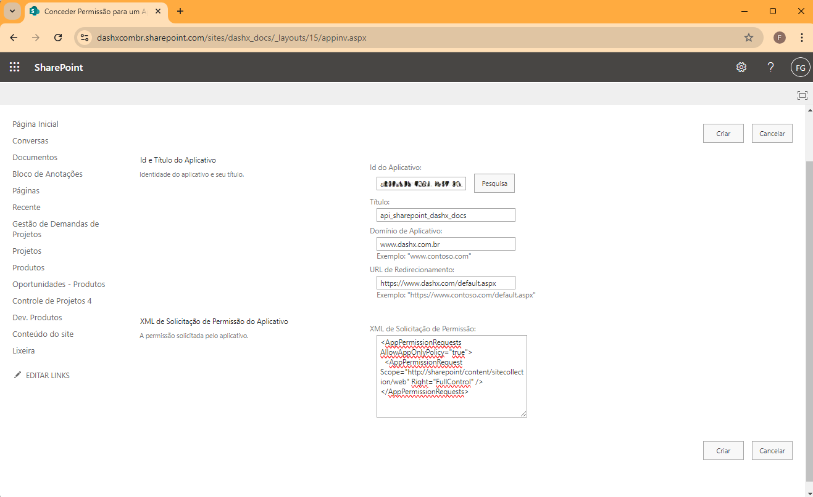
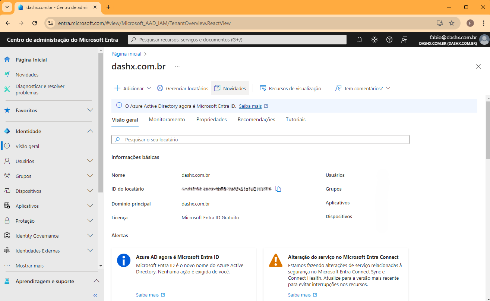

# get-activity-events-pbi
Projeto de ETL com o objetivo de coletar tratar e guardar dados de eventos de uso da plataforma Power BI Services.

# Como usar
$ docker build -t get-activity-events-pbi .
$ docker run get-activity-events-pbi

# Como obter dados via API dos eventos de uso do Power BI (client id,  secret id) 

    1º Criar aplicação Microsoft Entrar
        - Entrar na central de administração Microsoft: https://entra.microsoft.com/#home
        - Ir até "Aplicativos>>Registros de Aplicativos" clicar em "Novo Registro"

    2º Criar secret id para a aplicação
        - Em "Registros de Aplicativos" localicar a aplicação criada
        - Abrir a sessão "Certificados e segredos" e clicar em "Novo Segredo do cliente" e definir uma periodo de validade para a o secred
        - Salvar secred id criado

    3º Criar grupo de segurança: para a liberação de acesso admin para a aplicação é necessario criar um grupo de segurança e add a aplicação criada ao grupo
        - Em "Grupos>>Todos os Grupos" localicar o botão "Novo Grupo"
        - Selecionar o tipo de grupo como "Segurança" dar  um nome ao grupo e clicar em "Criar"

    4º Add aplicação criada ao novo grupo de segurança 
        - Em "Grupos>>Todos os Grupos" localicar o novo grupo criar e abrir
        - Em "Membros" clicar em "Adicionar Membro" e add a aplicação criada no passo 1º.
        

    5º Liberar acesso de Administrador Power BI ao grupo criado
        - Acessar a site da plataforma do Power BI Services: https://app.powerbi.com/
        - Em "Portal de Administração", pesquisar por "Configurações da API de Administração"
        - Add a grupo de segurança criado e clicar em "Aplicar"

    Com isso vc terá obtido as variaveis de ambiente:
        -ms_powerbi_client_id
        -ms_powerbi_secret_id

# Como obter acesso de leitura e escrita via API para o SharePoint (client id,  secret id e tenant id e tenant name)
    
    1º Entrar no sessão de gerencia de aplicações, para isso vc vai precisar substituir as variaveis "minhaempresacombr" e "meusharepoint"
        - https://{minhaempresacombr}.sharepoint.com/sites/{meusharepoint}/_layouts/15/appregnew.aspx

    2º Preencher os campos solicitados e cliciar em "Criar"

    
    Importante: após clicar em "Criar" salvar os dados de client_id e secret

    3º Abrir link abaixo, para isso vc vai precisar substituir as variaveis "minhaempresacombr" e "meusharepoint"
            https://{minhaempresacombr}.sharepoint.com/sites/{meusharepoint}/_layouts/15/appinv.aspx
    
    4º Com o client_id criado no passo anterior pesquisar a aplicação e usar e seguite codigo de autorização para escrita e leitura:

        <AppPermissionRequests AllowAppOnlyPolicy="true">
            <AppPermissionRequest Scope="http://sharepoint/content/sitecollection/web" Right="FullControl" />
        </AppPermissionRequests>

    4º Obter o tenant id e tenant name:
        - Entrar na central de administração Microsoft: https://entra.microsoft.com/#home
        - Ir até "Identidade>>Visão Geral" e localizar os parametros "ID do locatário" e "Nome"

    Com isso vc terá obtido as variaveis de ambiente:
        - ms_tenant_id 
        - ms_tenant 
        - ms_sharepoint_client_id 
        - ms_sharepoint_client_secret

